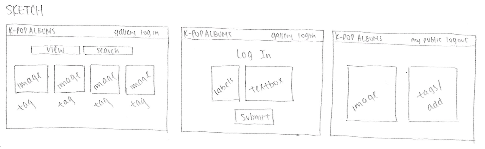
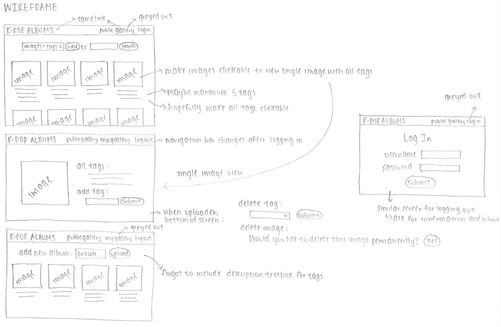

# Project 3 - Design & Plan

Your Name: Vicky Chou

## 1. Persona

[Tell us why you picked your persona in 1-3 sentences.]

I have selected Abby as my persona because Abby enjoys listening to a wide variety of music and my photo gallery intends to showcase different K-pop albums.

*update: I have also selected Abby as my persona because I intend for my website to be quite self-explanatory, of which will thus be most applicable to users like her who have low confidence in working with new and unfamiliar technologies.*

## 2. Sketches & Wireframes

### Sketches



### Wirefames



[Explain why your design would be effective for your persona. 1-3 sentences.]

My design meets the needs of my persona because they are easy to navigate and to-the-point. They depict a visible navigation bar at the top of every screen that informs the user the distinction between being an active, involved user of the website and being a general, public user of the website as well as provide only the options available to the user if she has the right to implement those actions (ie. delete an image that she uploaded herself).

## 3. Database Schema Plan

[Describe the structure of your database. You may use words or a picture. A bulleted list is probably the simplest way to do this.]

table 2: users
* field 1: id  
&nbsp;&nbsp;&nbsp; type: INTEGER  
&nbsp;&nbsp;&nbsp; constraints: PK, U, NOT, AI
* field 2: firstname  
&nbsp;&nbsp;&nbsp; type: TEXT  
&nbsp;&nbsp;&nbsp; constraints: NOT
* field 3: lastname  
&nbsp;&nbsp;&nbsp; type: TEXT  
&nbsp;&nbsp;&nbsp; constraints: NOT
* field 4: username
&nbsp;&nbsp;&nbsp; type: INTEGER    
&nbsp;&nbsp;&nbsp; constraints: U, NOT
* field 5: password  
&nbsp;&nbsp;&nbsp; type: TEXT  
&nbsp;&nbsp;&nbsp; constraints: NOT

table 2: images
* field 1: id  
&nbsp;&nbsp;&nbsp; type: INTEGER  
&nbsp;&nbsp;&nbsp; constraints: PK, U, NOT, AI
* field 2: user_id  
&nbsp;&nbsp;&nbsp; type: INTEGER    
&nbsp;&nbsp;&nbsp; constraints: NOT
* field 3: image  
&nbsp;&nbsp;&nbsp; type: TEXT   
&nbsp;&nbsp;&nbsp; constraints: U, NOT

*note: I removed the U constraint for the user_id field in the images table because each user can upload multiple images.*

table 3: tags
* field 1: id  
&nbsp;&nbsp;&nbsp; type: INTEGER  
&nbsp;&nbsp;&nbsp; constraints: PK, U, NOT, AI
* field 2: tag  
&nbsp;&nbsp;&nbsp; type: TEXT    
&nbsp;&nbsp;&nbsp; constraints: U, NOT

table 4: gallery
* field 1: id  
&nbsp;&nbsp;&nbsp; type: INTEGER  
&nbsp;&nbsp;&nbsp; constraints: PK, U, NOT, AI
* field 2: image_id  
&nbsp;&nbsp;&nbsp; type: INTEGER    
&nbsp;&nbsp;&nbsp; constraints: NOT
* field 3: tag_id  
&nbsp;&nbsp;&nbsp; type: INTEGER    
&nbsp;&nbsp;&nbsp; constraints: NOT

## 4. Database Query Plan

[Plan your database queries. You may use natural language, pseudocode, or SQL.]

<u>view all images:</u>  
SELECT image FROM images;

<u>view all images for a tag:</u>  
SELECT images.image, images_tags.tag_id FROM images RIGHT JOIN images_tags ON images.id = images.tag_id;

<u>view all tags for an image:</u>  
SELECT images.image, images_tags.tag_id FROM images LEFT JOIN images_tags ON images.id = images.tag_id;

<u>upload a new image:</u>  
SELECT id FROM users WHERE username=<i>logged_user</i>;
INSERT INTO images (user_id, image) VALUES (logged_id, image_new);    

<u>remove an image:</u>  
DELETE FROM images WHERE image=<i>clicked_image</i>;

<u>view all tags:</u>  
SELECT tag FROM tags;

## 5. Structure and Pseudocode

### Structure

[List the PHP files you will have. You will probably want to do this with a bulleted list.]

* includes/init.php
* includes/header.php
* includes/image.php
* index.php - public gallery
* private.php - private gallery
* session.php - log in/log out

### Pseudocode

[For each PHP file, plan out your pseudocode. You probably want a subheading for each file.]

#### includes/init.php

```
// DB helper functions (you do not need to write this out since they are provided.)

db = connect to db

...

check the current state of user
create $current_user variable

```

#### includes/header.php

```
identifies current page and styles navigation bar accordingly

```

#### includes/image.php

```
if user clicks on image {
  delete table/grid of images
  display specified image
}
```

#### index.php

```
include init.php
include image.php

will display a table/grid

create form (selection) for users to choose if they want to view both images and tags (default), only images, or only tags

create form (search box) for users to search tags
  use GET request for search and filter input
    if (isset($_GET["search_tags"])) {
      filter sanitize string (tag)
      ...
      use sql LIKE as in project 2
    }

```

#### private.php

```
include init.php
include image.php

this page will only appear if user has logged in

create form for users to upload new images
  use FILES for image files and POST for tags and filter input
    if (isset($_FILES["image_file"])) {
      ...
      if (isset($_POST["image_description"])) {
        filter sanitize string (description)
        ...
      }
      if 'error' == 0 {
        $sql = INSERT INTO...
        echo 'Image was successfully uploaded. Thank you!'
      }
      else {
        echo 'Image failed to be uploaded. Please try again.'
      }
    }
  escape output

add delete buttons for every image and tag

```

#### session.php

```
include init.php

create form for users to log in
  use POST request and filter input
    if (isset($_POST["user_login"])) {
      filter sanitize string (username)
      filter sanitize string (password)
      ...
    }
    if either username or password are not in database or do not match {
      echo 'Invalid username or password.'
    }
    else {
      echo 'You have logged in as [username]!'
    }
  escape output
create form for users to log out
  ask users to confirm they want to log out
    confirm button

```

## 6. Seed Data - Username & Passwords

[List the usernames and passwords for your users.]

* hello_world : password1
* goodbye_world : password2
